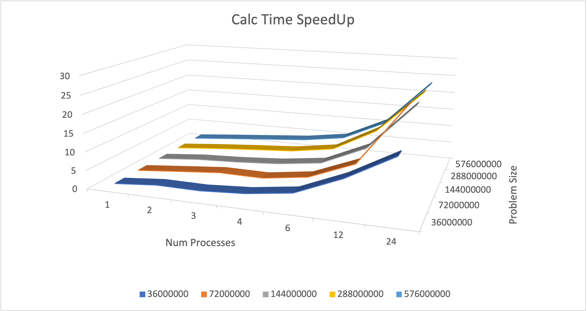
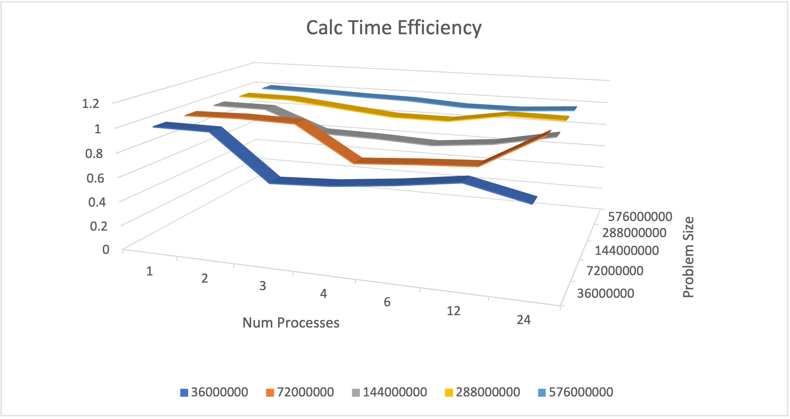
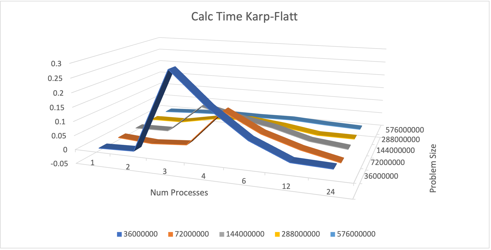
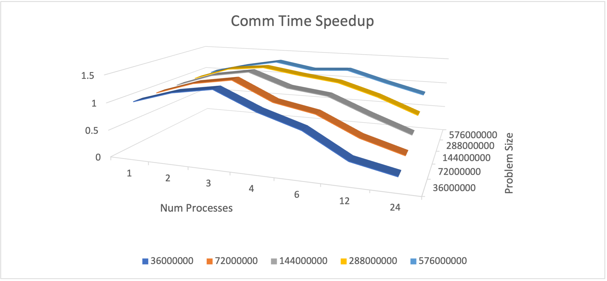
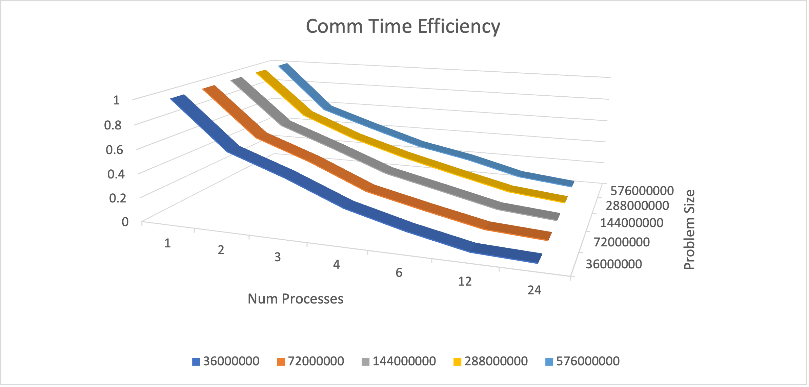
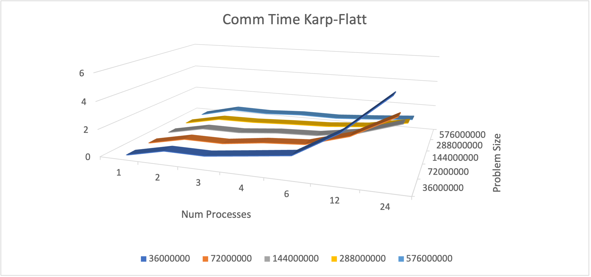
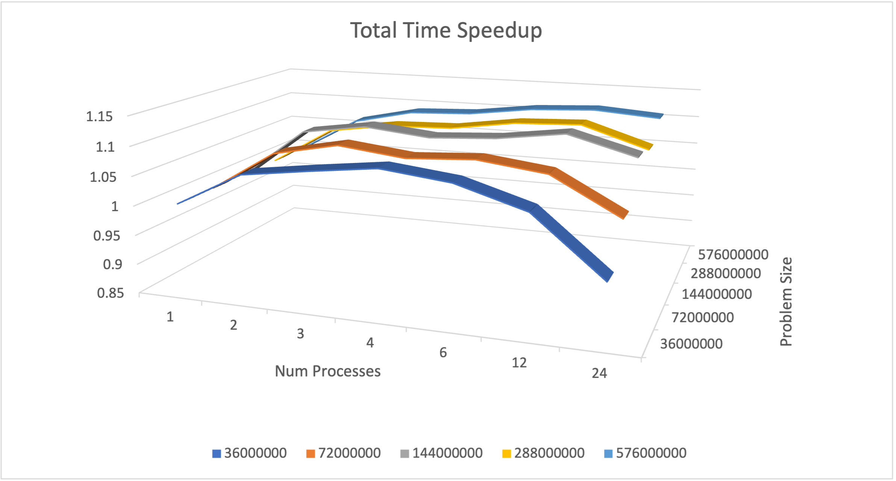
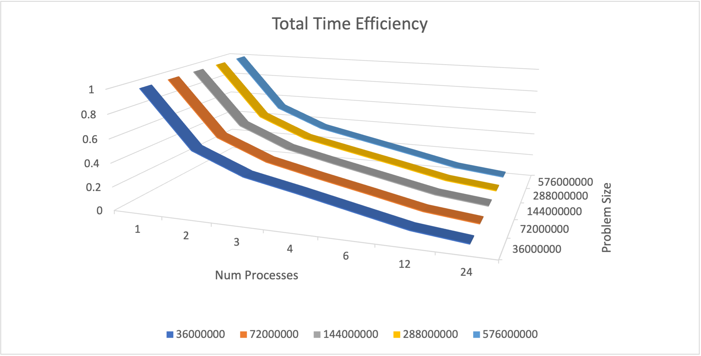
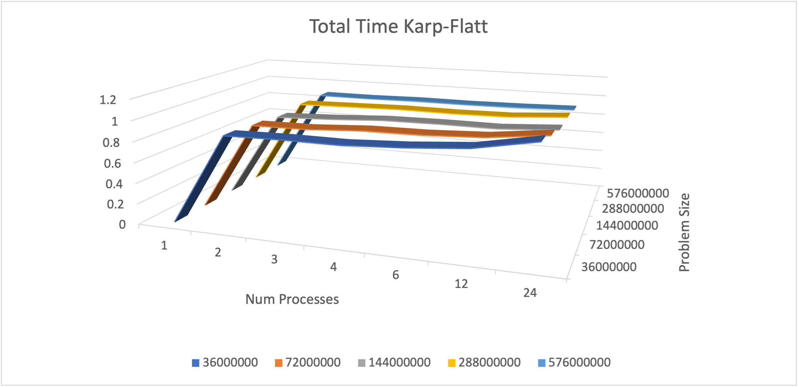

# Matrix-Vector Multiplication

## Starting your own Repo ##

Follow these steps:

1. Create your appropriately named repo on Gitlab.

2. On your local computer: 
    - if using SSH, run  `git clone -b main --single-branch git@gitlab.com:ijroebke/cs4170_fa2022_a02_roebke.git`. 


    - If using HTTPS, run `git clone -b main --single-branch https://gitlab.com/ijroebke/cs4170_fa2022_a02_roebke.git`

3. `cd cs4170_fa2022_a02_roebke`

4. `git remote remove origin`. This removes the current remote named `origin`.

5. `git remote add origin <URL_OF_YOUR_REPO>`. This adds a new remote that has the address of your repo.

6. `git branch -m master`. This changes the name of the current branch (mpi) to master.

6. `git push -u origin master`. This pushes your changes.

## Running ##
To compile and run with Docker issue the following commands from the root of the project (not in the Default folder):
```
docker run --rm -v ${PWD}:/tmp -w /tmp/Default rgreen13/alpine-mpi-boost make all
docker run --rm -v ${PWD}:/tmp -w /tmp/Default rgreen13/alpine-mpi-boost mpiexec --allow-run-as-root -n X MPI A B
```
where `X` is the number of nodes, `A` is dimension x of the matrix, and `B` is the shared dimension of the vector and matrix.

Remember to always use cmd-line arguments for the dimensions of the matrix.
## Using OSC ##
Move all the files to the Ohio Supercomputing Center (OSC) server of your choice. Make sure to build your code, using `make OSC` and then modify the `jobScript.slurm` accordingly. Submit from inside the `Default` directory using 
```
sbatch jobScript.slurm
```

You may also do this using http://ondemand.osc.edu

## Summary ##
For this assignment my task was to design and parallelize a matrix-vector multiplication algorithm. We also were permitted to use the boost library. I submitted my code to OSC and created a spreadsheet for analysis of my code's performance.

## Algorithm ##
For my solution, the dimensions of the matrix are fed in from the cmd-line. The parallel function is called and first, my master process generates the matrix and the vector to be multiplied. 


The matrix is just a vector with rows * columns length. I access the correct index with (row * column) + column index.


Next, the vector is broadcasted to the other processes and the matrix is scattered to local matrices. These matrices are smaller than the original matrix, such that all the local matrices together equal the length of the original matrix.


Now, the local matrices are multiplied by the vector and the result is kept as a new local vector. Importantly, the local matrices are split by rows. So every local matrix has the same column size as the original vector. 


Now, the local resulting vector from the multiplication is a piece of the entire result vector. These vectors are gathered and the final result vector is pieced together.


Finally, the master process outputs all the times and data points. Also, the root asserts the parallel multiplication was performed correctly by checking with a serial multiplication.

## Method ##
For my first attempt, I wanted to use a vector of vectors for my matrix. This proved to be impossible with scatter and gather. So, I changed plans and flattened my original matrix into a regular vector.

I wanted to keep the column dimension unchanged for each of my local matrices. This simplified the multiplication and communication. If I had more time for the assignment I could try to put the processes into a cartesean communication block and split the matrix by rows and columns.

## Analysis ## 
By far, my best metric was my Calc Time.

Speedup is a measure of how much speed you are gaining by adding more processes.
Efficiency is a measure of how many resources your solution is using.
Karp-Flatt is a measure of how well your code is parallelized, and how scalable it is. Lower values are better.

# Calc Time #




# Comm Time #




# Total Time #



